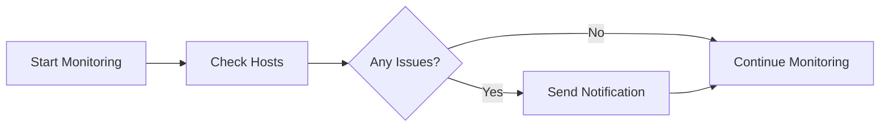

# 🖥️ Nagios Monitoring Study Guide for Beginners


A **complete guide** to set up and use **Nagios** for continuous monitoring of hosts, services, and web applications using Docker. Includes installation, configuration, monitoring examples, practical exercises, and troubleshooting tips.

---

## 📚 Table of Contents

1. [Continuous Monitoring Concepts](#continuous-monitoring-concepts)  
2. [Introduction to Nagios](#introduction-to-nagios)  
3. [Installation of Nagios using Docker](#installation-of-nagios-using-docker)  
4. [Nagios Configuration](#nagios-configuration)  
5. [Monitoring Web Servers](#monitoring-web-servers)  
6. [Using Nagios Web Interface](#using-nagios-web-interface)  
7. [Deploying a Simple Web Application](#deploying-a-simple-web-application)  
8. [Practical Exercises](#practical-exercises)  
9. [Troubleshooting Guide](#troubleshooting-guide)  
10. [License](#license)

---

## 🔍 1. Continuous Monitoring Concepts

**Definition:**  
Continuous monitoring is the practice of constantly observing IT infrastructure, applications, and services in real-time to ensure optimal performance and quick problem resolution.  

**Benefits:**  
- ⚡ **Proactive Issue Detection** – Identify problems before they impact users  
- ⏱️ **Reduced Downtime** – Minimize service interruptions  
- 📈 **Performance Optimization** – Track system metrics continuously  
- ✅ **Compliance** – Meet regulatory requirements  
- 💼 **Business Continuity** – Ensure critical services stay operational  
- 💰 **Cost Reduction** – Prevent expensive outages  

---

## 🖥️ 2. Introduction to Nagios

**What is Nagios?**  
Nagios is an **open-source monitoring system** that watches hosts and services, alerting users when things go wrong and when they recover.  

**Key Features:**  
- 🖧 Comprehensive monitoring (hosts, services, network devices)  
- 🧩 Plugin architecture for custom monitoring  
- 📬 Alerts via email, SMS, or custom notifications  
- 🌐 Web dashboard for real-time monitoring  
- ⚙️ Event handlers for automated responses  
- 📊 Historical data and reporting  
- 🌍 Distributed monitoring  

**Architecture Diagram (Mermaid):**
```mermaid
graph TD
    A[Monitored Hosts & Services] --> B[Plugins]
    B --> C[Nagios Core Engine]
    C --> D[Web Interface & Notifications]
````

---

## 🐳 3. Installation of Nagios using Docker

**Prerequisites:**

* Docker Desktop installed 🐋
* At least 2GB RAM 💾
* Command line knowledge 💻

**Create Project Directory & Files:**

```bash
mkdir -p nagios/etc nagios/var custom-plugins web-content
echo "<h1>Test Web Server</h1><p>For Nagios monitoring demo.</p>" > web-content/index.html
```

**docker-compose.yml**

```yaml
version: '3.8'

services:
  nagios:
    image: jasonrivers/nagios:latest
    container_name: nagios
    ports:
      - "8080:80"
    environment:
      - NAGIOSADMIN_USER=nagiosadmin
      - NAGIOSADMIN_PASS=password123
    volumes:
      - ./nagios/etc:/opt/nagios/etc
      - ./nagios/var:/opt/nagios/var
      - ./custom-plugins:/opt/Custom-Nagios-Plugins
    restart: unless-stopped

  web-server:
    image: nginx:alpine
    container_name: test-web-server
    ports:
      - "8081:80"
    volumes:
      - ./web-content:/usr/share/nginx/html
    restart: unless-stopped
```

**Start Containers**

```bash
docker-compose up -d
docker-compose ps
```

**Access Nagios Web Interface:**

* 🌐 URL: `http://localhost:8080/nagios`
* 🔑 Username: `nagiosadmin`
* 🔑 Password: `password123`

---

## ⚙️ 4. Nagios Configuration

**Configuration Files:**

```
/opt/nagios/etc/
├── nagios.cfg
├── cgi.cfg
├── resource.cfg
└── objects/
    ├── commands.cfg
    ├── contacts.cfg
    ├── hosts.cfg
    ├── services.cfg
    └── timeperiods.cfg
```

**Sample Host & Service**

```bash
define host {
    host_name test-web-server
    alias Test Web Server
    address web-server
    check_command check-host-alive
    max_check_attempts 3
    contact_groups admins
}

define service {
    host_name test-web-server
    service_description HTTP
    check_command check_http
    max_check_attempts 3
    contact_groups admins
}
```

**Validate Configuration**

```bash
docker-compose restart nagios
docker exec nagios /opt/nagios/bin/nagios -v /opt/nagios/etc/nagios.cfg
```

---

## 🌐 5. Monitoring Web Servers

**Service Checks:**

* HTTP ✔️
* Ping ✔️
* Response Time ⏱️

**Custom Command Example**

```bash
define command {
    command_name check_http_port
    command_line /opt/nagios/libexec/check_http -H $HOSTADDRESS$ -p $ARG1$
}
```

---

## 🖥️ 6. Using Nagios Web Interface

**Main Sections:**

* 📊 Tactical Overview – Hosts & Services status
* 🏠 Host Management – Schedule downtime, add comments
* 🔧 Service Management – Force checks, passive results
* 📜 Reports – Historical trends

**Workflow Diagram**



---

## 🚀 7. Deploying a Simple Web Application

* Multi-container setup: **Nagios**, **Web App**, **Database**, **API Server**
* Configure hosts & services for each component in Nagios

---

## 🏋️ 8. Practical Exercises

1. **Basic Monitoring Setup:** Start Docker environment, check hosts & services
2. **Service Testing:** Stop/Start containers, check Nagios alerts
3. **Scheduled Downtime:** Simulate maintenance and verify suppressed notifications
4. **Custom Plugin Development:** Example: Disk usage check
5. **External Service Monitoring:** Monitor websites & SSL certificates

---

## 🛠️ 9. Troubleshooting Guide

**Common Issues & Fixes:**

* ⚠️ Configuration errors → Validate configs (`nagios -v`)
* ❌ Plugin problems → Check permissions & execution
* 🌐 Web interface issues → Check container logs & port mapping
* 🔍 Service failures → Test plugin manually, check network

**Backup & Recovery**

```bash
# Backup
docker exec nagios tar -czf /tmp/nagios-config-backup.tar.gz /opt/nagios/etc/

# Restore
docker cp ./backup/nagios-config-backup.tar.gz nagios:/tmp/
docker exec nagios tar -xzf /tmp/nagios-config-backup.tar.gz -C /opt/nagios/etc/
```

---

## 📄 10. License

This project is licensed under the **MIT License**.

---

